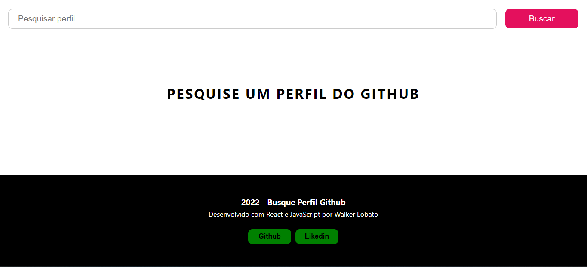
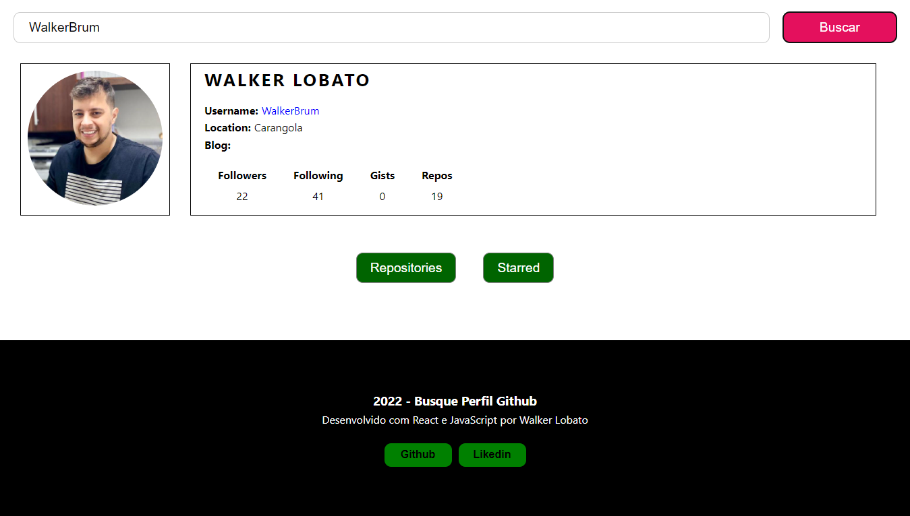
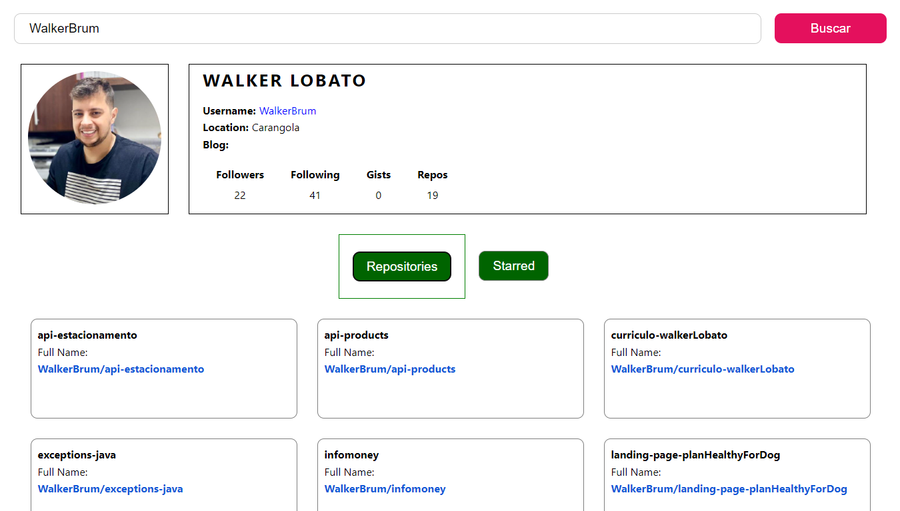
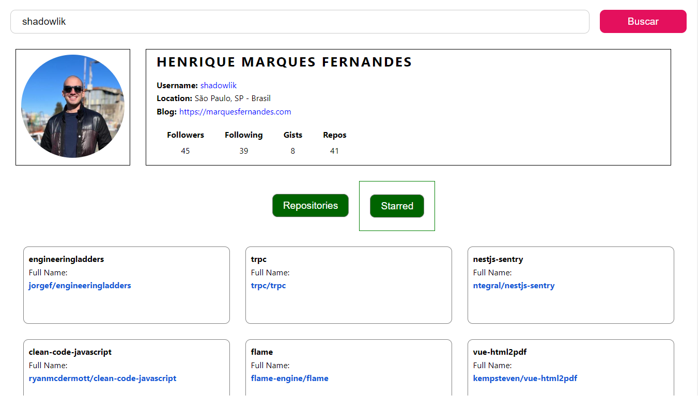

# **Sistema Buscar Usuário do Github** 

## **Descrição**
Aplicação front-end para interação visual com a API do Github para buscar perfis de usuários e seus respositórios;

## **Acessar Aplicação**
[https://buscador-perfis-github-git-main-walkerbrum.vercel.app/](https://buscador-perfis-github-git-main-walkerbrum.vercel.app/)

## **Objetivos**
- Criar aplicação com ReactJs utilizando Context API, Styled Components e Hooks;

## **Tecnologias**
Este projeto foi desenvolvido com as seguintes tecnologias: 
- JavaScript;
- ReactJs;
- React Hooks;
- React Context API;
- Styled Components;
- Axios;

## **Requerimentos**
- Node.js;
- npm ou yarn;

## **Instalação**
`npm install`

## **Clone do Projeto**
`git clone https://github.com/WalkerBrum/search-github-profile-react.git`

# 📷 Demonstração da Aplicação

## **Autor e Agradecimento**
Eu Walker Lobato como desenvolvedor do projeto sou grato por poder participar desse desafio, pois foi um grande oportunidade para conhecer funcionalidades bibliotecas novas do react como ContextAPI, useCallback e Styled Compoents, além de evoluir nas que já conhecia, com isso, contribuindo para o desenvolvimento das minhas hard skills, aprimorando os meus conhecimentos na construção de aplicações web.
